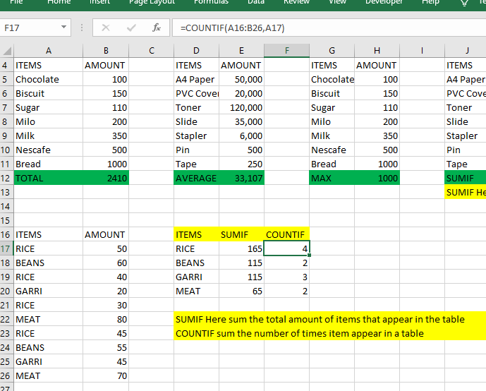

# Basic-Excel-Formula

## Introduction

This is basic excel formula for calculations such as sum, average, max, min, sumif, countif, Ifstatement, Vlookup, index, index-match and formula to clean data such as Join, sort, filter, clean function, proper function, trim function and Len function.

**Disclaimer**; This is not a real company data but a fictional data for the purpose of this project.

## Problem Statement

**The goal of this project is to**

•	Demonstrate the ability to use basic excel formula for calculations

•	Demonstrate ability to use excel functions to clean data

•	Demonstrate ability to sort data ascending or descending order

•	Ability to use excel functions to pull out a particular information from a range of data

•	Finally, to create pivot table and chart with excel

## Skills and concepts demonstrated

•	Excel formula & functions (sum, average, max, min, sumif, countif, Ifstatement, Vlookup, index, index-match, Join, sort, filter, clean, value, proper, Isnumber)

## Data Source;
Fictional data

## Data transformation 
•	Several formulas and functions were written to get the right values needed.

 The views are;

 SUM FUNCTION

 

 Average function

 

 Maximum function

 

If function

SUMIF FUNCTION

CountIf function 

Index 

Function to detect if it is a number or not

Len function

 

